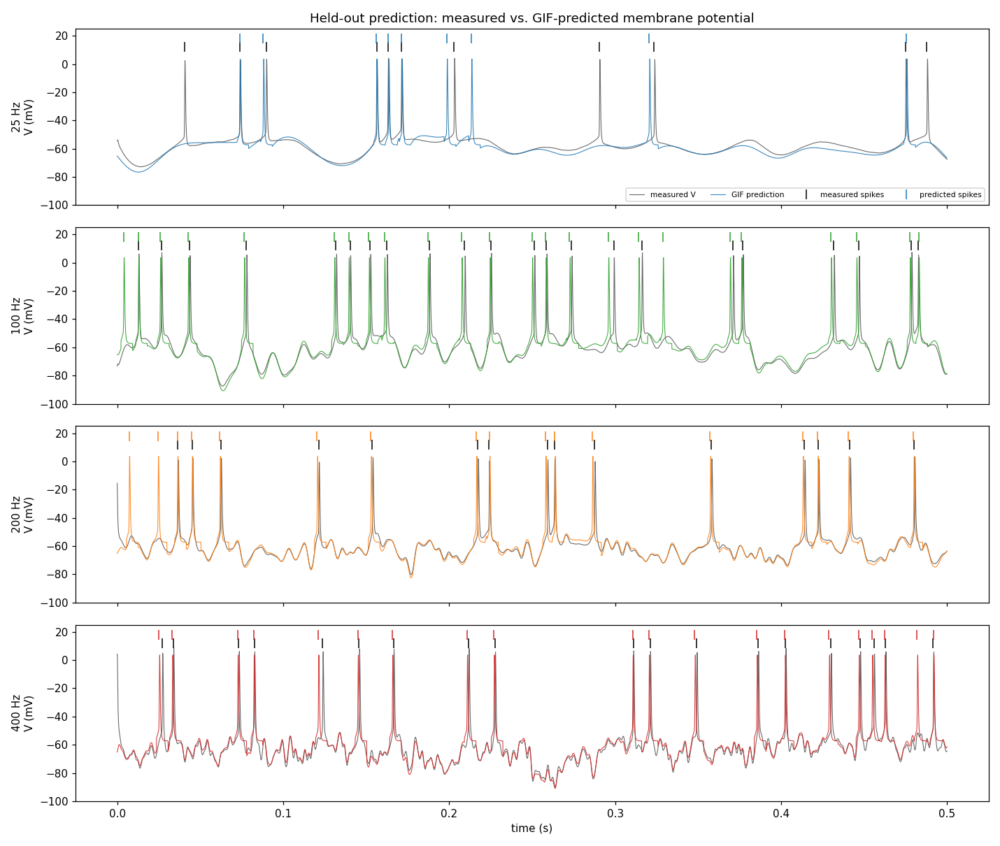

# 🧠 Blind neuron-model recovery

An explicit **Generalized Integrate-and-Fire** equation for one neuron's membrane potential **V(t)**,
recovered from injected current `I(t)` and validated on held-out data — four bandwidth conditions, one cell.

### [▶&nbsp; Report](https://maxwellsdm1867.github.io/asta-rgc-challenge/report.html) &nbsp;·&nbsp; [▶&nbsp; Visual brief](https://maxwellsdm1867.github.io/asta-rgc-challenge/brief.html) &nbsp;·&nbsp; [Live site](https://maxwellsdm1867.github.io/asta-rgc-challenge/)

Held-out prediction — measured (grey) vs. GIF-predicted (colour) membrane potential across the four conditions. &nbsp;·&nbsp; Task spec: <a href="mission.md"><code>mission.md</code></a>

---

**See it, in order** → **[1 · Report](https://maxwellsdm1867.github.io/asta-rgc-challenge/report.html)**
(how the equation was found) → **[2 · The answer](model/params.json)** (the equation + fitted
parameters) → **[3 · Full trace](trace.tar.gz)** (the complete session trajectory — every tool call
and the agent's reasoning, so anyone can see exactly how it was derived).

> **Results in one line** *(skip if you just want the files)* — the answer is a **Generalized
> Integrate-and-Fire (GIF)** model; held-out **Victor–Purpura distance = 2.91 / s (q = 4)**,
> subthreshold **R² = 0.87**. The full equation, fitted parameters, and per-condition metrics live in
> the report — [`index.qmd`](index.qmd) (text) and [`brief.html`](brief.html) (one-page visual). The
> equation itself is [`model/params.json`](model/params.json).

## Where everything is

### The answer (deliverables)
| path | what it is |
|---|---|
| [`model/params.json`](model/params.json) | **the fitted equation** — every GIF parameter, with units |
| [`model/predict.py`](model/predict.py) | **the predictor** — `predict_voltage(I) → V` (one trial; state reset per call) |
| `predictions/pred_cond{25,100,200,400}Hz.csv.gz` | **held-out predictions** — `trial_id, t_s, voltage_mV`, one row per input sample |

### The report
| path | what it is |
|---|---|
| [`index.qmd`](index.qmd) | full write-up: equation, data→model derivation, params, per-condition held-out metrics, failure modes |
| [`brief.html`](brief.html) | one-page visual brief (self-contained, inline SVG) — the best single file to open |
| [`figures/`](figures/) | prediction overlays, fitted kernels, dynamic I–V, metrics (PNG) |
| [`references.bib`](references.bib) | the 8 sources actually relied on |

### How it was made
| path | what it is |
|---|---|
| [`data/`](data/) | the recordings — `train_*` + `heldout_inputs_*` (gzipped CSV, 10 kHz); see [`data/DATA_DICTIONARY.md`](data/DATA_DICTIONARY.md) |
| [`model/glif_fit.py`](model/glif_fit.py) | reproducible fit — spike detection, regression, VP optimization; writes `params.json` + `heldout_metrics.json` |
| [`model/make_report_figures.py`](model/make_report_figures.py) | regenerates everything under `figures/` |
| [`model/heldout_metrics.json`](model/heldout_metrics.json) | per-condition held-out metrics (the report's numbers come from here) |
| [`work/`](work/) | the project notebook — [`project.md`](project.md) + per-step READMEs under `work/<slug>/` |

### Challenge meta
| path | what it is |
|---|---|
| [`mission.md`](mission.md) | the task spec |
| [`trace.tar.gz`](trace.tar.gz) | **full session trajectory** — every tool call + the agent's reasoning (the challenge-format trace; ~11 MB) |
| [`SKILLS_FEEDBACK.md`](SKILLS_FEEDBACK.md) | reflection on the Asta skills (tools, not science) |
| [`FEEDBACK_AUDIT.md`](FEEDBACK_AUDIT.md) | per-claim citations grounding `SKILLS_FEEDBACK.md` against the trace |
| [`RESEARCH_CHALLENGE.md`](RESEARCH_CHALLENGE.md) · [`SUBMISSION.md`](SUBMISSION.md) | challenge write-up + submission-form draft |

> **Run it** *(skip unless reproducing)* — clean venv (`python3 -m venv venv && source venv/bin/activate`;
> `pip install "numpy<2" "pandas>=2" scipy matplotlib numba`), then
> `python model/glif_fit.py` → `python model/predict.py` → `python model/make_report_figures.py` →
> `quarto render`. Use the venv: the system Anaconda has a broken numpy/pandas ABI. Predictor import:
> `from model.predict import predict_voltage`.
